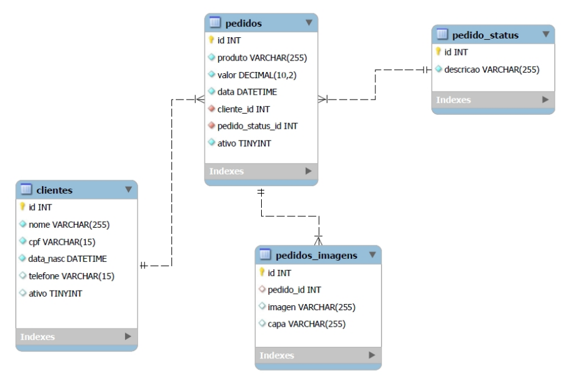

## Sobre este projeto

Aplicação web em PHP que permite criar, ler, atualizar e deletar (CRUD) clientes e pedidos.

## Funcionalidades

- upload de imagens;
- exportação em CSV;

## Como rodar

`php artisan serve`

## Como acessar

`http://localhost:8000/`

## Tecnologias utilizadas

- [Intervention](https://image.intervention.io/v3);
- [Wamp](https://wampserver.aviatechno.net/);
- [Bootstrap](https://getbootstrap.com/);

## DER (Diagrama Entidade-Relacionamento)

    

## DataBase

- Mysql;

## DataBase Export

- [Archive](leme.sql).

# Autores

| [ Rafael Garrett](https://github.com/camilafernanda) |
| :---: | 
